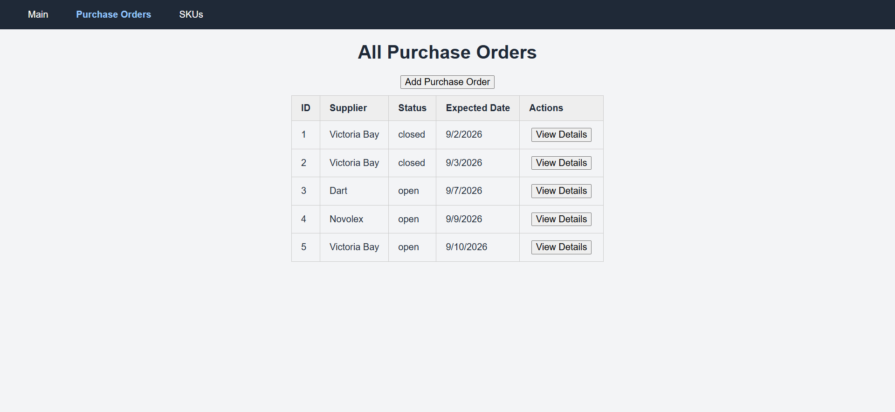
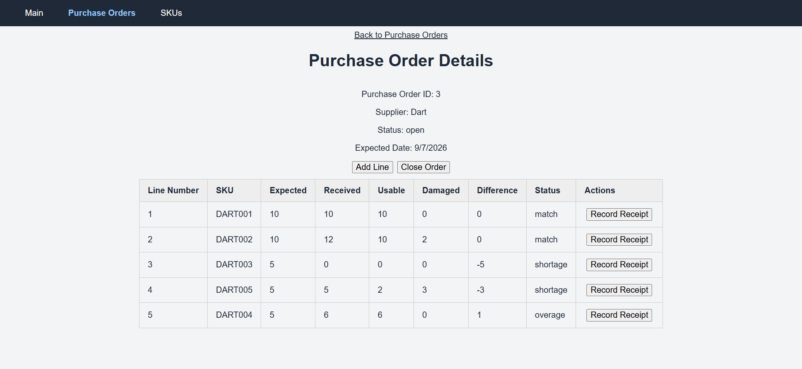
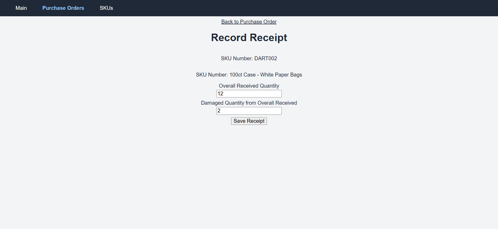
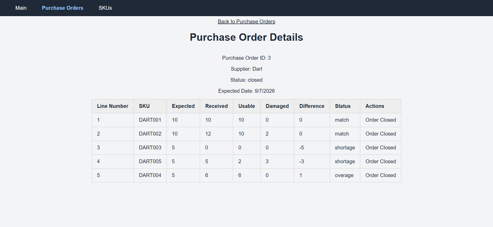
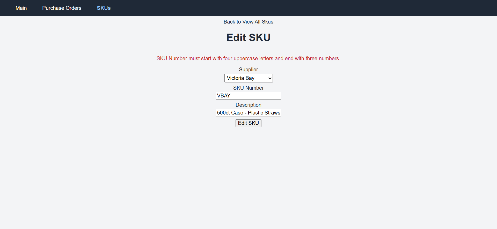

# Receiving Tracker

A full-stack warehouse receiving application for comparing expected purchase-order quantities with the quantities actually received and damaged.

The project is based on a real warehouse workflow: receiving staff record shipment results, review quantity discrepancies, and close completed purchase orders. It was built as a focused warehouse management system project using TypeScript throughout the API and client.

## Current Features

- View purchase orders and their line items
- Create purchase orders and add SKU lines
- Record received and damaged quantities
- Calculate usable quantities and expected-versus-received differences
- Close completed purchase orders
- Prevent receipt entry and other protected actions on closed orders
- View, create, and edit SKUs
- Associate SKUs and purchase orders with suppliers
- Navigate feature-specific pages through a React interface
- Display loading, validation, empty, and API error states

## Project Demo

The repository includes screenshots that demonstrate the application's interface and core workflows without requiring visitors to configure and run the application locally.

### Application Images

The [`images`](./demo_content/images) folder contains screenshots of viewing all purchase orders, line details for a purchase order, receiving a purchase order line, viewing all SKUs while inspecting the main navigation dropdown, and editing a SKU with input error feedback. These images provide a quick visual overview of the workflow and can be viewed directly through GitHub.



## Technology Stack

### API

- Node.js
- TypeScript
- Express 5
- SQL Server
- `mssql` with `msnodesqlv8`
- `dotenv`

### Client

- React 19
- TypeScript
- React Router
- Vite
- ESLint

### Database

- Microsoft SQL Server

### Development Tools

- Visual Studio Code
- SQL Server Management Studio
- Git and GitHub

## Project Structure

```text
warehouse-receiving-tracker/
├── client/
│   └── src/
│       ├── components/          Shared interface components
│       ├── features/
│       │   ├── purchase-orders/ Purchase-order pages, hooks, and services
│       │   ├── skus/            SKU pages, components, and services
│       │   └── suppliers/       Supplier pages, hooks, and services
│       ├── pages/               Index pages
│       ├── utilities/           Reusable helper functions for rendering data
│       ├── App.tsx              Application routes and top-level layout
│       └── main.tsx             React entry point
├── database/
│   ├── script.sql               Tables, relationships, constraints, and indexes
│   └── seed.sql                 Demonstration dataset
demo_content/
└── images/                      Demo images of application workflow
├── src/
│   ├── config/                  Database and environment configuration
│   ├── controllers/             HTTP request handling and responses
│   ├── repositories/            SQL Server data-access operations
│   ├── routes/                  Express endpoint definitions
│   ├── scripts/                 Test scripts
│   ├── services/                Business and discrepancy calculations
│   ├── types/                   Shared server domain types
│   ├── utilities/               Reusable validation functions for data
│   └── index.ts                 Express application entry point
├── .env.example                 Example local configuration
├── package.json                 Server dependencies and commands
└── README.md                    Project documentation
```

## Getting Started

### Prerequisites

Install the following before running the project:

- Node.js 22 or a compatible current Node.js release
- npm
- SQL Server 2022 Express or another compatible SQL Server edition
- SQL Server Management Studio (recommended)
- Microsoft ODBC Driver 18 for SQL Server

The included environment example assumes a local SQL Server Express instance named `SQLEXPRESS` using Windows authentication.

### Installation

#### 1. Clone the repository and install the server dependencies:

```bash
git clone https://github.com/ddibiasio2952/warehouse-receiving-tracker.git
cd warehouse-receiving-tracker
npm install
```

#### 2. Install the client dependencies:

```bash
cd client
npm install
cd ..
```

#### 3. Environment Configuration

Create a local `.env` file from the example:

```bash
copy .env.example .env
```

Default development configuration:

```env
PORT=3000
DB_SERVER=localhost\SQLEXPRESS
DB_NAME=receiving_database
DB_DRIVER=ODBC Driver 18 for SQL Server
```

Update these values if your SQL Server instance or database uses a different name. The local `.env` file is ignored by Git.

#### 4. Database Setup

The repository includes separate scripts for the database structure and demonstration data:

  1. Open SQL Server Management Studio and connect to your SQL Server instance.
  2. Open `database/script.sql`.
  3. Execute the script to create `receiving_database`, its tables, relationships, constraints, defaults, and indexes.
  4. Open `database/seed.sql`.
  5. Execute the script to insert the demonstration dataset.

Always run `script.sql` before `seed.sql`. The seed data represents the scenarios used to validate the application and is intended for a newly created, empty database.

#### 5. Running the Application

Start the API from the repository root:

```bash
npm run go
```

This compiles the TypeScript server and starts the generated application from `dist/index.js`. By default, the API runs on port `3000`.

In a second terminal, start the React development server:

```bash
cd client
npm run dev
```

Open the local address displayed by Vite, normally:

```text
http://localhost:5173
```

## Demonstration Workflow

A useful way to evaluate the application is:

### 1. View the seeded purchase orders and SKUs.
### 2. Open a purchase order and inspect its expected line quantities.

### 3. Record received and damaged quantities for an eligible line.

### 4. Review the calculated usable quantity and discrepancy.
### 5. Close a completed purchase order.
### 6. Confirm that closed-order restrictions are enforced.


## Available Commands

### Server

Run these commands from the repository root:

| Command | Purpose |
| --- | --- |
| `npm run build` | Compile the TypeScript server |
| `npm start` | Run the compiled server |
| `npm run go` | Build and start the server |
| `npm run test-db` | Build and run the database connection test |
| `npm run test-repository` | Build and run the repository test script |

### Client

Run these commands from `client/`:

| Command | Purpose |
| --- | --- |
| `npm run dev` | Start the Vite development server |
| `npm run build` | Type-check and build the client |
| `npm run lint` | Run ESLint |
| `npm run preview` | Preview the production client build |

## Data Model

The application uses four principal tables:

- `Suppliers` stores supplier profiles.
- `Skus` stores items and associates each SKU with a supplier.
- `PurchaseOrders` stores supplier orders, expected dates, and workflow statuses.
- `PurchaseOrderLines` stores expected, received, and damaged quantities for each ordered SKU.

Foreign keys preserve the relationships between suppliers, SKUs, purchase orders, and purchase-order lines. Database constraints enforce valid statuses and quantities in addition to validation performed by the API.

## Validation and Error Handling

The application validates identifiers, quantities, dates, supplier data, and SKU data before repository operations. SQL Server constraints provide an additional data-integrity layer. The client displays loading, invalid-request, missing-record, and API failure states to the user.



## Project Status

This project is under active development as a portfolio demonstration of full-stack TypeScript development and warehouse-domain problem solving.

## Current Limitations

- Purchase-order review data is available through the API, but a dedicated review page has not yet been implemented.
- Suppliers support the application’s data relationships, but dedicated supplier viewing and creation pages have not yet been implemented.

## License

All rights reserved.

This repository is provided for portfolio and demonstration purposes. The source code may be viewed, but it may not be copied, modified, redistributed, or used in another project without permission.

## Author

Daniel DiBiasio

[GitHub](https://github.com/ddibiasio2952/)
